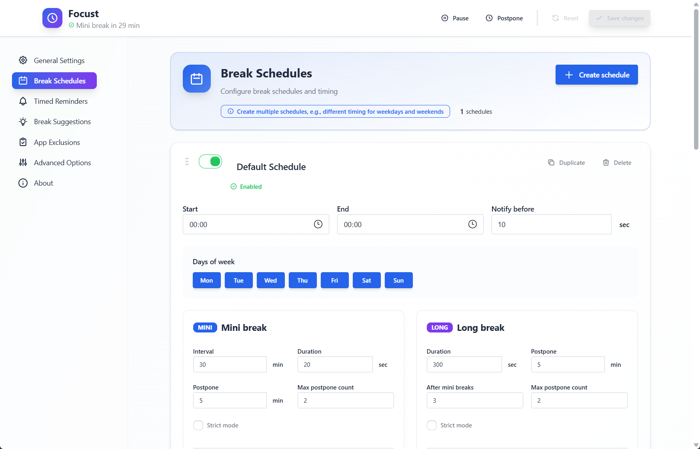
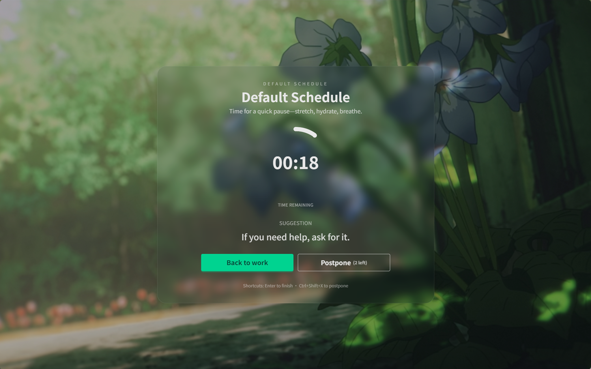
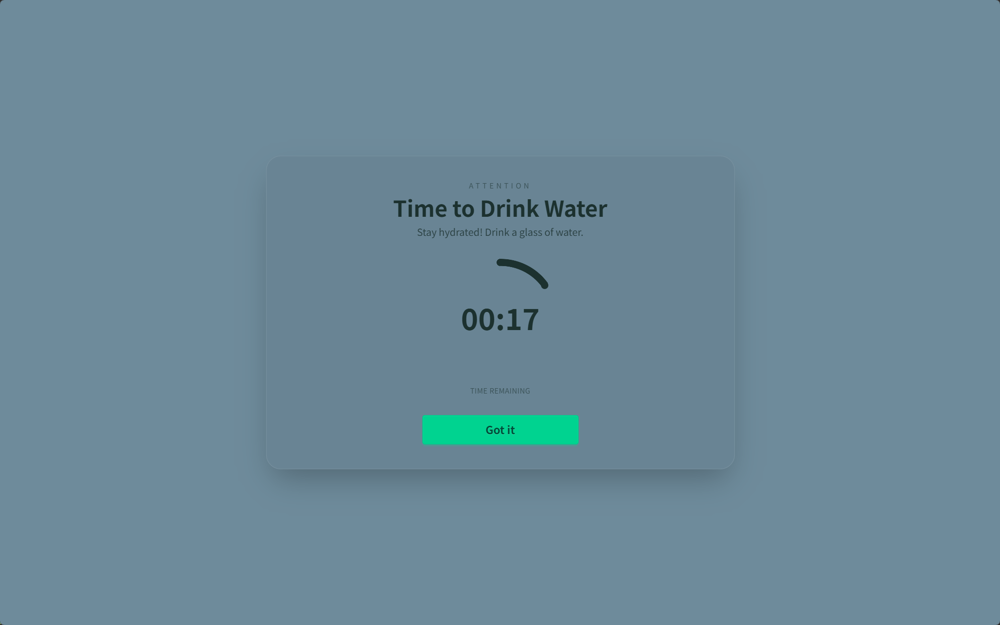
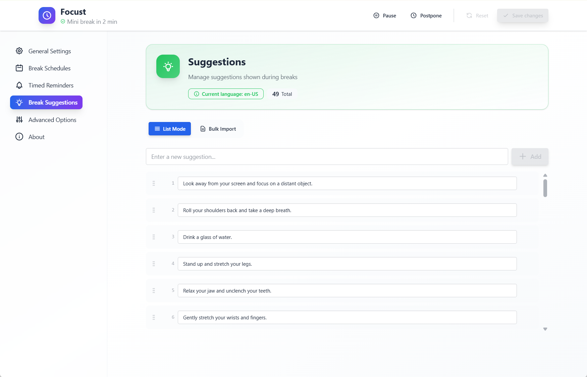

# Focust

<div align="center">

<!--  -->

**A modern, cross-platform break reminder application**

[](LICENSE)
[](https://tauri.app/)
[](https://vuejs.org/)
[](https://www.rust-lang.org/)

Take regular breaks, protect your eyes, and maintain healthy work habits with customizable schedules, beautiful themes, and intelligent reminders.

[Quick Start](#-quick-start) • [Features](#-features) • [Installation](#-installation) • [Building](#-building-from-source) • [Contributing](#-contributing) • [Documentation](#-documentation)

**[简体中文](README.zh-CN.md)** | **[English](README.md)**

</div>

---

> [!CAUTION]
> **Early Development Notice**
> 
> Focust is currently in active early development and rapid iteration. This is my first Rust project, and I'm learning as I build. You may encounter bugs, incomplete features, or breaking changes. Your patience, feedback, and contributions are greatly appreciated! 🙏
>
> **Platform Support**: While Focust is designed to be cross-platform (Windows, macOS, Linux), it has currently only been tested on **Windows**. If you're on macOS or Linux, please try it out and report any issues you encounter. Platform-specific contributions are especially welcome!

---

## 📋 Quick Start

See the [QUICKSTART.md](docs/QUICKSTART.md) for a step-by-step guide to getting started with Focust.

## ✨ Features

### 🕐 Smart Break Scheduling

- **Flexible Break Types**: Configure mini breaks (short 20s pauses) and long breaks (5-minute rest periods)
- **Customizable Intervals**: Set your own break frequency — mini breaks every 20 minutes, long breaks after 4 mini breaks
- **Time-Based Schedules**: Create different schedules for work hours, restrict breaks to weekdays, or set custom time ranges
- **Intelligent Detection**: Automatically pauses breaks when you're away from your computer
- **Postpone Support**: Need 5 more minutes? Postpone breaks with a global hotkey or button click


*Configure multiple break schedules with custom time ranges and active days*

### 🎨 Beautiful & Customizable Themes

- **Rich Backgrounds**: Choose from solid colors, single images, or random images from a folder
- **Full Customization**: Adjust text color, blur effects, opacity, font size, and font family
- **Visual Feedback**: See your break window in full glory with customizable size (50%-100% or fullscreen)
- **Multi-Monitor Support**: Show break reminders on all monitors simultaneously


*Immersive break window with customizable themes and suggestions*

### 🔔 Timed Reminders (Attention System)

- **Alarm-Style Reminders**: Set specific times to remind yourself of important tasks
- **Non-Intrusive**: Unlike break reminders, these don't block your work — just gentle notifications and can be dismissed immediately
- **Multiple Times**: Add as many reminder times as you need throughout the day
- **Perfect For**: Drinking water, taking medication, standing up, or any time-sensitive task


*Set up timed reminders for healthy habits*

### 💡 Break Suggestions

- **Motivational Messages**: Get helpful suggestions during breaks (stretch exercises, eye exercises, hydration reminders)
- **Multi-Language Support**: Built-in suggestions in English, Chinese and other 8 common languages, with easy customization
- **TOML-Based Configuration**: Add your own custom suggestion lists
- **Random Selection**: Fresh suggestions every break to keep things interesting


*Customize break suggestions or use built-in curated lists*

### 🔊 Audio Notifications

- **Built-in Sounds**: Choose from 4 carefully selected notification sounds
  - Gentle Bell
  - Soft Gong
  - Bright Notification
  - Simple Notification
- **Custom Audio**: Use your own MP3, WAV, OGG, or FLAC files
- **Volume Control**: Adjust audio volume to your preference
- **Preview**: Test sounds before saving

### ⚙️ Advanced Features

- **System Tray Integration**: Minimize to tray, quick pause/resume, status indicators
- **Global Hotkeys**: Postpone breaks without switching windows
- **Strict Mode**: Force breaks when you really need them (cannot be skipped)
- **Break Notifications**: Get notified before breaks start (configurable lead time)
- **Automatic Pausing**: Detects system idle time and pauses the scheduler
- **DND Detection**: Automatically pauses breaks when Do Not Disturb/Focus Assist is enabled (Windows, macOS, Linux)
- **Application Exclusions**: Pause or resume scheduler based on active applications (e.g., pause during presentations, resume when coding)
- **Theme Modes**: Light, dark, or system-based theme for settings UI
- **Detailed Logging**: Debug logs for troubleshooting


*General settings with language, theme, and behavior options*

### 🌍 Internationalization

- Currently supported: English (en-US), Simplified Chinese (zh-CN), Japanese (ja-JP), German (de-DE), French (fr-FR), Spanish (es-ES), Russian (ru-RU), Portuguese (pt-BR), Italian (it-IT), Korean (ko-KR)
- Automatic language detection based on system locale
- Easy to add new languages (contributions welcome!)

### ⚡ Performance & Efficiency

Built with performance in mind, Focust offers exceptional resource efficiency:

- **Ultra-Low Memory Footprint**: Uses only ~5MB when running in the background, thanks to dynamic window creation and lazy-loaded Vue components
- **Native Performance**: Powered by Tauri's lightweight WebView instead of bundled Chromium
- **Fast Startup**: Cold start in under 2 seconds
- **Minimal CPU Usage**: <1% CPU when idle, <5% during break windows
- **Small Binary Size**: Significantly smaller than Electron-based alternatives

*Perfect for users who want break reminders without sacrificing system resources.*

---

## 📥 Installation

### Download Pre-built Binaries

Download the [latest release for your platform](https://github.com/pilgrimlyieu/Focust/releases/latest):
- **Windows**: `setup.exe` installer
- **macOS**: `.dmg` installer
- **Linux**: `.AppImage`

### Building from Source

See the [Building from Source](#building-from-source) section below for detailed instructions.

---

## 🚀 Building from Source

### Prerequisites

Before you begin, ensure you have the following installed:

1. **Node.js** (v18 or later) or **Bun** (recommended)
2. **Rust** (latest stable) - Install via [rustup](https://rustup.rs/)
3. **System Dependencies** (platform-specific):

   **Windows:**
   - [Microsoft Visual C++ Build Tools](https://visualstudio.microsoft.com/visual-cpp-build-tools/)
   - [WebView2](https://developer.microsoft.com/microsoft-edge/webview2/) (usually pre-installed on Windows 10/11)

   **macOS:**
   ```bash
   xcode-select --install
   ```

   **Linux (Debian/Ubuntu):**
   ```bash
   sudo apt update
   sudo apt install build-essential \
     curl \
     wget \
     file \
     libwebkit2gtk-4.1-dev \
     libsoup-2.0-dev \
     libappindicator2-dev \
     librsvg1-dev \
     patchelf \
     libasound1-dev \
     libxss-dev
   ```

4. **Just** (optional but recommended) - Command runner
   ```bash
   cargo install just
   ```

### Clone and Setup

```bash
# Clone the repository
git clone https://github.com/pilgrimlyieu/Focust.git
cd Focust

# Install dependencies
bun install  # or: npm install / yarn install

# Setup Rust dependencies
cd src-tauri
cargo build
cd ..
```

Or use Just:
```bash
just setup
```

### Development

```bash
# Start development server with hot-reload
bun run tauri dev  # or: npm run tauri dev

# Using Just
just dev
```

### Production Build

```bash
# Build optimized production bundle
bun run tauri build  # or: npm run tauri build

# Using Just. Will build with updater signing (requires private key setup)
just build
```

The built application will be available in `src-tauri/target/release/bundle/`.

> **Note:** For updater signed releases, see [Updater Signing Guide](docs/UPDATER_SIGNING.md) to set up signing keys.

### Available Commands (Just)

If you have [Just](https://github.com/casey/just) installed, you can use these convenient commands:

```bash
just setup          # Setup project environment
just dev            # Start development server
just build          # Build production bundle
just build-debug    # Build debug bundle

# Code Quality
just format         # Format all code (Rust + TypeScript)
just lint           # Run all linters
just check          # Type checking and static analysis
just test-all       # Run all tests

# Platform-Specific
just format-front   # Format frontend code only
just format-back    # Format backend code only
just lint-front     # Lint frontend only
just lint-back      # Lint backend only

# See all available commands
just
```

---

## 🤝 Contributing

Contributions are warmly welcomed! Whether it's bug reports, feature requests, documentation improvements, or code contributions — all help is appreciated.

### How to Contribute

1. **Report Issues**: Found a bug? [Open an issue](https://github.com/pilgrimlyieu/Focust/issues/new)
2. **Suggest Features**: Have an idea? [Start a discussion](https://github.com/pilgrimlyieu/Focust/discussions)
3. **Improve Documentation**: Spot a typo or unclear instruction? Submit a PR
4. **Write Code**: Check [CONTRIBUTING.md](CONTRIBUTING.md) for detailed development guidelines

### Areas Needing Help

- 🐧 **Linux Testing & Support**: Help test and fix Linux-specific issues
- 🍎 **macOS Testing & Support**: Verify functionality on macOS
- 🌍 **Translations**: Add new language support (Japanese, German, French, Spanish, etc.)
- 🎨 **UI/UX Improvements**: Design suggestions and implementations
- 🐛 **Bug Hunting**: Find and report issues
- 📝 **Documentation**: Improve guides and add tutorials

### Development Resources

- [CONTRIBUTING.md](CONTRIBUTING.md) - Contribution guidelines and development setup
- [docs/ARCHITECTURE.md](docs/ARCHITECTURE.md) - Project architecture and code structure
- [docs/CONFIGURATION.md](docs/CONFIGURATION.md) - Configuration file reference

---

## 📖 Documentation

- **[Architecture Guide](docs/ARCHITECTURE.md)** - Detailed project architecture, frontend/backend design, and core logic
- **[Configuration Reference](docs/CONFIGURATION.md)** - Complete guide to all configuration options
- **[Contributing Guide](CONTRIBUTING.md)** - How to contribute, coding standards, and development workflow

---

## 🛠️ Technology Stack

### Frontend

- **Vue 3.5** - Progressive JavaScript framework with Composition API
- **TypeScript 5.9** - Type-safe JavaScript
- **Pinia 3** - Intuitive state management
- **Tailwind CSS 4** - Utility-first CSS framework
- **DaisyUI 5** - Component library for Tailwind
- **Vue I18n 11** - Internationalization
- **Vite 7** - Lightning-fast build tool
- **Vitest 4** - Unit testing framework

### Backend
- **Rust (2024 edition)** - Systems programming language
- **Tauri 2** - Cross-platform desktop framework
- **Tokio** - Asynchronous runtime
- **Serde** - Serialization framework
- **ts-rs** - TypeScript type generation from Rust

### Tools
- **Just** - Command runner
- **Biome** - Code formatter and linter
- **Cargo** - Rust package manager

---

## 🗺️ Roadmap

- [x] Whitelist applications (v0.2.0 major goal)
- [x] DND mode detection (v0.2.0 goal)
- [ ] Improved error handling and user feedback
- [ ] Project icon
- [ ] Comprehensive platform testing (macOS, Linux)

---

## 📄 License

This project is licensed under the MIT License - see the [LICENSE](LICENSE) file for details.

---

## 🙏 Acknowledgments

- Inspired by [Stretchly](https://github.com/hovancik/stretchly) - The excellent break reminder app
- Built with [Tauri](https://tauri.app/) - The fantastic framework for building desktop apps
- Icons from various open-source projects
- Audio files from royalty-free sources

<div align="center">

**If you find Focust helpful, please consider giving it a ⭐️ on GitHub!**

</div>
